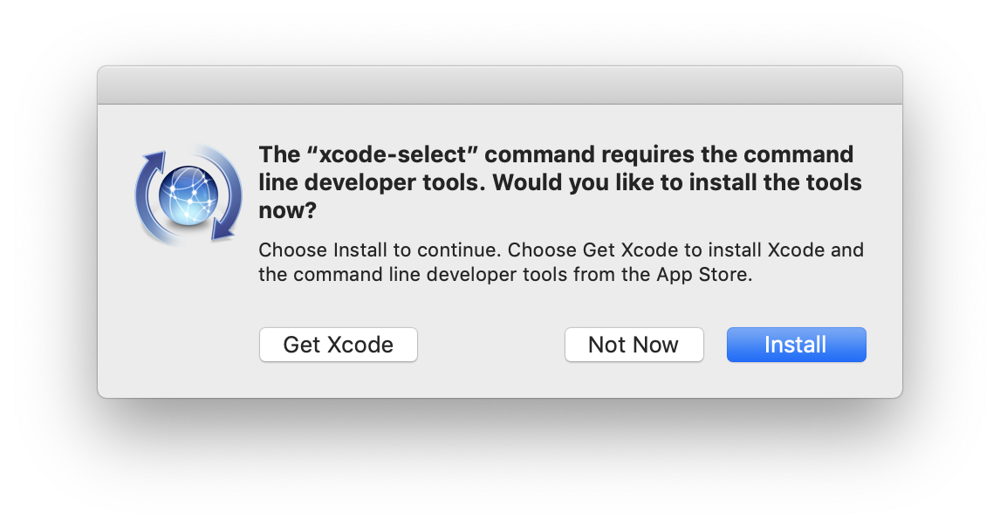

# How to install Xcode Command Line Tools?

1. Go to Terminal in `/Applications/Utilities/`.
2. Input the following command string in Terminal: `xcode-select —-install`
3. In the same way when you are downloading new software and apps, a popup update window will appear asking you: “The xcode-select command requires the command line developer tools. Would you like to install the tools now?”

    

4. Select confirm by clicking Install.
5. Wait for the Xcode Command Line Tools package to install. It is around 130 MB and usually installs fairly quickly, although it depends on your connection.
6. Once everything is installed, the installer goes away and you should be able to any of the new commands that you’ve now got access to.